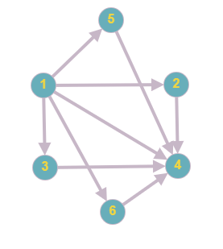

# Find Celebrity

## Description

In a team of n people, a celebrity is known by everyone but he/she doesn't know anybody.

The most important of this project is the algorithm used to solve the problem. There are two approach an imperative
and other functional method to resolve this problem. You can configure the algorithm modifying the `approach` property in
the `application.yml` by default this property is `Imperative`

## Prerequisites

Only it is necessary to have installed Java 8 and Maven.

## Compiling

As any maven project you only need to run the command

`mvn clean install`

## Run

The project can be executed using the next command:

`mvn spring-boot:run -pl app`

## Execute Unit Test

The project can be executed using the next command:

`mvn clean test`

## Example

### Celebrity Graph

The algorithm should find the person with id `4` 

### Configure Graph in Database

You can configure the graph modifyng the `V1__init.sql` 

### Check the celebrity

Check the result through of the next url

`http://localhost:8080/api/celebrity/search`

### Expected response (Example)
`
{
    "id": 4,
    "peopleKnown": []
}
`
## Others

The technologies used in this project were the next:

* Java 8
* Spring Boot 2.1.0.RELEASE
* Lombok
* AsserJ
* Junit 5
* Mockito
* H2 Memory DataBase
* Flyway
